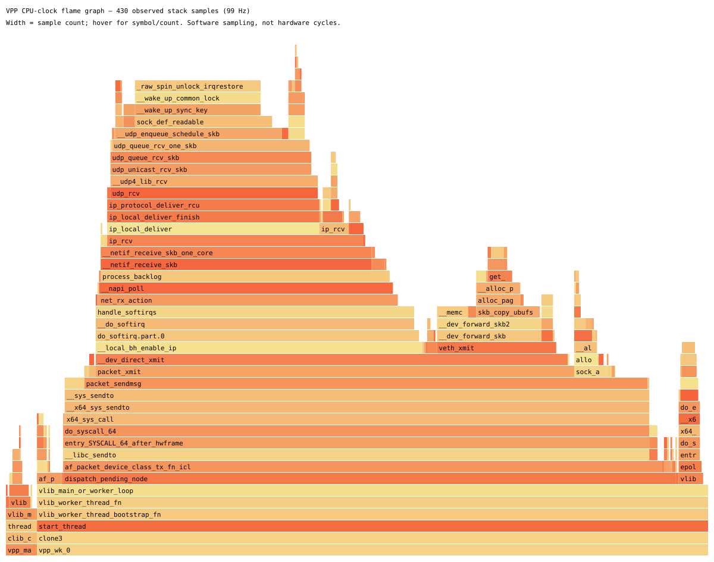

# Performance report: local VPP + Rust bench

Measured on 3 October 2026. All values below come from submitted artifacts;
preliminary invalid-mode runs are excluded. This is a single-host WSL2 bench,
not a physical-NIC line-rate benchmark.

## Topology and reproduction

Variant 1 was chosen because the available machine has Ubuntu 24.04 in WSL2
and an existing VPP source build. Two namespaces (`rc-a` 10.44.0.1/24,
`rc-b` 10.44.0.2/24), each with a veth pair, are connected through two VPP
AF_PACKET host interfaces. There is no alternate Linux bridge connecting them.

On ingress A, the device-input feature sends UDP through
`rust-classify-node` → `rust-classify-forward` → interface-output → B.
Packets are forwarded unchanged. ARP and TCP/ICMP control traffic use a normal
bidirectional L2 cross-connect; ingress B does not classify return traffic.
Runtime passthrough keeps the same custom nodes and egress, but skips
`packet_classify`. CLI mode changes remove the previous exact opaque binding
under VPP's worker barrier before installing the new configuration.

Reproduction commands, setup/teardown ownership rules, configs and profiling
commands are in [README.md](README.md). Run `build.sh`, `validate.sh`,
`matrix.sh`, then `mitigation.sh`; `summarize.py` reconstructs the full
[CSV](results/measurements.csv) and [artifact table](results/measurements.md).
The final tags are `final` and `mitigation`. Both release and debug C builds
passed, as did fmt, clippy with warnings denied and all 28 Rust tests.

Hardware: Intel i7-11800H, 16 logical CPUs / 8 cores / one NUMA node, Microsoft
WSL2 kernel 6.6.87.2. VPP source commit:
`ad78811002ef8983103f1c0d2f589a7386067c9b`.
See [environment](results/environment.txt) and
[VPP commit](results/vpp-commit.txt). Release VPP was used for measurement.
Main CPU 0, worker CPU 2 (plus CPU 4 for two workers), sender CPU 6 are on
distinct reported physical cores. Sink userspace processes are not pinned.
RX mode is interrupt; one TX queue per interface is shared among workers.

## Sanity and zero-load baseline

`sanity.sh` runs 2 seconds of 100 Kbit/s external UDP and asserts both a valid
Rust trace and positive sink reception. See [trace](results/final-sanity/trace.txt)
and [client JSON](results/final-sanity/client.json). The independent raw-frame
integration check passed exact delivery/counters for valid UDP and IPv4
options, and drops for unsupported EtherType, fragments, truncation and
invalid UDP length. Passthrough delivered all six unchanged frames.
See [classify trace](results/integration/classify-trace.txt),
[passthrough trace](results/integration/passthrough-trace.txt) and
[validation log](validation.log). Traces explicitly expose mode and egress.

After sanity, trace, runtime, interface and error counters are cleared, then
the bench idles for 2 seconds. In the [idle runtime](results/final-idle/run.txt)
the worker has no packet vectors and `rust-classify-node` is absent: its
cycles/vector is **not applicable**, not a measured zero. Interfaces are up;
there are no classification/drop errors. Background timers/main-thread CLI
work continue. No NIC packet rate can be inferred from an idle node's timing.
[Idle errors](results/final-idle/errors.txt),
[interfaces](results/final-idle/interface.txt),
[hardware](results/final-idle/hardware-interfaces.txt) and
[compressed stats segment](results/final-idle/stats.txt.gz) preserve the baseline.

## Load and counters

Each load run is 10 s, payload 512 bytes. iperf3 UDP gives fixed payload bitrate
plus receiver loss/jitter. The stdlib Python UDP generator uses eight sockets
and paced batches with a preallocated payload, and an independent counting
receiver. Its send count measures successful local socket submissions, not
wire delivery. PPS and bandwidth are achieved sender values. Reported Mbit/s
excludes Ethernet/IP/UDP overhead; jitter is not RTT.

Each run captures before/after `show run`, `show errors`, hardware/interface
counters, buffers, RX placement, thread affinity, stats-segment dump,
namespace/veth counters, softnet, ethtool and kernel UDP counters. Counters
below are interval values after clearing; multi-worker error sections are
summed. VPP's `Clocks` column is reported as clocks/vector rather than equated
to perf's hardware `cycles` event. Low-load batching/timer overhead can
dominate it. `forwarded_ok` is an informational success counter despite being
displayed under `show errors`.

| Tool / requested rate | Offered PPS | Payload Mbit/s | Classify clocks/vector | forwarded_ok | malformed / unsupported / dropped | Loss % | Jitter ms |
| --- | ---: | ---: | ---: | ---: | --- | ---: | ---: |
| iperf / 1 Mbit/s | 244.19 | 1.000 | 1700 | 2443 | 0 / 0 / 0 | 0 | 3.94400 |
| iperf / 50 Mbit/s | 12205.58 | 49.994 | 58.8 | 122060 | 0 / 0 / 0 | 0 | 0.05728 |
| iperf / 1 Gbit/s | 244118.60 | 999.910 | 44.1 | 2441258 | 0 / 0 / 0 | 0.21915 | 0.00083 |
| custom / 1k PPS | 999.99 | 4.096 | 329 | 10000 | 0 / 0 / 0 | 0 | N/A |
| custom / 20k PPS | 19999.66 | 81.919 | 57.6 | 200000 | 0 / 0 / 0 | 0 | N/A |
| custom / 200k PPS | 199996.48 | 819.186 | 45.0 | 1999995 | 0 / 0 / 0 | 0.00290 | N/A |

All real-load runs generated valid UDP; malformed/drop paths were verified
separately. The 1 Gbit/s run overloads the sink queue in bursts, even though
VPP itself is not proven to be CPU-saturated. The classifier forwarded count
can exceed iperf's reported data count by its UDP handshake probe; node vectors
also include ARP/TCP packets that bypass classification. `timed out block` in
AF_PACKET is a block retirement event, not a packet-drop count.

## Passthrough comparison

| Tool / load | Classify clocks/vector | Passthrough clocks/vector | Difference | Classify / passthrough loss % |
| --- | ---: | ---: | ---: | --- |
| iperf / 1 Mbit/s | 1700 | 1210 | 490 | 0 / 0 |
| iperf / 50 Mbit/s | 58.8 | 79.9 | -21.1 | 0 / 0 |
| iperf / 1 Gbit/s | 44.1 | 28.2 | 15.9 | 0.21915 / 0.21444 |
| custom / 1k PPS | 329 | 310 | 19.0 | 0 / 0 |
| custom / 20k PPS | 57.6 | 35.4 | 22.2 | 0 / 0 |
| custom / 200k PPS | 45.0 | 25.6 | 19.4 | 0.00290 / 0 |

At high load the two tools independently show roughly 16–19 clocks/vector
for the Rust-call path. This includes parsing and result-dependent dispatch;
it does **not** isolate ABI call instructions from Rust parsing. The custom
node and forward node remain in both paths. The negative middle iperf result
demonstrates timing noise and different batching, so a single difference is
not a universal FFI constant. The highest classify iperf run was profiled
concurrently; custom runs were not, adding an independent unprofiled comparison.

## Workers, queues, affinity and NUMA

Eight sender sockets exercise AF_PACKET flow fanout; an iperf single UDP flow
would not demonstrate balanced use of two queues. Queue counts here are
AF_PACKET software queues, not physical-NIC RSS queues. Ethtool ring/channel
operations unsupported by veth are saved as limitations rather than invented
NIC capacities. The recorded `show interface rx-placement` confirms placement.

| Custom ~200k PPS configuration | Per-worker clocks/vector | Total forwarded | Loss % | Sink RcvbufErrors |
| --- | --- | ---: | ---: | ---: |
| 1 worker, 1 RX queue | 45.0 | 1999995 | 0.00290 | 58 |
| 1 worker, 2 RX queues on worker 0 | 49.9 | 1998877 | 0.12045 | 1305 |
| 2 workers, 2 RX queues split | 48.6 / 47.0 | 1998130 | 0.09115 | 0 |

The two-worker run processed almost exactly one million vectors per worker;
see [placement](results/final-two-workers-two-queues/after/interface-rx-placement.txt),
[runtime](results/final-two-workers-two-queues/after/run.txt) and
[errors](results/final-two-workers-two-queues/after/errors.txt).
It did not beat the simpler one-worker/one-queue baseline. All 1823 missing
datagrams in the two-worker run were already missing at the classifier:
1999953 submitted − 1998130 forwarded = 1823. With no sink RcvbufErrors or
classifier drops, this bounds loss to before the node; the available counters
do not identify whether sender/kernel/AF_PACKET RX ring caused each loss.
The classifier is lock-free across workers, but the whole bench is not:
one shared AF_PACKET TX queue, kernel networking and one receiver remain.
Changing workers/queues changes batching and scheduling as well as concurrency.

| iperf ~1 Gbit/s | Context switches / 10 s | CPU migrations | Node clocks/vector | Loss % |
| --- | ---: | ---: | ---: | ---: |
| CPU affinity applied | 11251 | 0 | 44.1 | 0.21915 |
| VPP task affinity widened to CPUs 0–15 | 11114 | 14 | 47.3 | 0.12555 |

`perf stat` and thread `Cpus_allowed_list` confirm the comparison. Affinity
prevented migrations but did **not** reduce context switches or establish
better loss in this single pair of runs. Interrupt wakeups and receiver
scheduling dominate those counts. This is `main-core`/`corelist-workers` plus
`taskset` affinity, not `isolcpus` or exclusive host CPU reservation; Windows
and WSL can still preempt these virtual CPUs. A reboot/host isolation was not
performed or claimed.

`lscpu` reports exactly one NUMA node. A NIC-local/remote socket experiment
cannot be measured on this topology. On multi-socket physical hardware, remote
worker access to NIC-local buffers would be expected to add interconnect
traffic and memory latency, increasing cycles/vector and potentially reducing
throughput. No NUMA-mismatch numbers are fabricated.

## Hypothesis, profiling and mitigation

**Hypothesis:** at 1 Gbit/s, the main observed bottleneck is receiver/kernel
queue handling around AF_PACKET transmission; the sink UDP receive buffer
overflows in bursts. Rust classification is not the primary loss source.
This predicts VPP forwarding all offered valid packets, zero classifier drops,
kernel sink RcvbufErrors matching generator loss, and sensitivity to socket
buffer size.

The highest-load [perf report](results/final-iperf-classify-1000000000/perf-report.txt)
contains 430 CPU-clock samples with no lost samples. AF_PACKET TX is on 85.35%
of sampled call stacks; `__libc_sendto` is on 83.49%. These are **inclusive**
percentages, not additive self CPU times. The Rust node has 0.93% inclusive
samples and `packet_classify` 0.47%; at this sample count these small shares
are imprecise. The TX stack includes kernel `packet_sendmsg`, veth/softirq,
IP and UDP delivery. Software sampling therefore explains time charged to
the worker that actually runs downstream kernel receive work.

The [folded stacks](results/final-iperf-classify-1000000000/flamegraph.folded)
support independent viewing. Raw `perf.data` is available locally for Hotspot;
Hotspot GUI was not used on Windows. Perf stat collects task-clock,
context-switches, migrations, cycles and instructions; hardware counters were
also available in this WSL guest, but are not treated as bare-metal calibration.

In the final high-load classify run, sink `RcvbufErrors` increased by **5350**,
exactly matching iperf's 5350 lost sequence numbers. VPP had zero malformed,
unsupported or dropped packets. In the custom one-queue high run, all 58
missing datagrams likewise match sink RcvbufErrors. Together with profiling
and passthrough results, this supports the hypothesis for these runs.

**Attempted mitigation:** `mitigation.sh` alternates default socket buffers
and `iperf3 -w 212992` at the same load, three repetitions. The sink JSON
records actual buffer sizes: 212992 bytes default vs 425984 bytes after Linux
doubles the requested size. This tunes the receiver queue without changing
global sysctls or optimizing code without evidence.

| Repetition | Default offered Mbit/s / node clocks/vector | Default loss % / RcvbufErrors | Larger buffer offered Mbit/s / node clocks/vector | Larger buffer loss % / RcvbufErrors |
| --- | --- | --- | --- | --- |
| 1 | 999.899 / 43.2 | 0.03519 / 859 | 999.918 / 49.9 | 0.06456 / 1576 |
| 2 | 999.907 / 51.4 | 0.05604 / 1368 | 999.914 / 56.6 | 0.19117 / 4667 |
| 3 | 999.909 / 45.7 | 0.22665 / 5533 | 999.919 / 46.6 | 0.04969 / 1213 |

**Outcome: no consistent improvement.** Larger buffers reduced loss in only
one of three pairs. The mean loss changed from 0.10596% to 0.10181%, a small
difference compared with run variability; the median worsened from 0.05604%
to 0.06456%. It would be misleading to claim a reliable speedup from this
experiment. All six loss counts still match sink UDP RcvbufErrors, supporting
the bottleneck location without establishing that doubling the buffer fixes
receiver scheduling or burst handling. The before/after JSON and SNMP snapshots
are under `results/mitigation-*`; actual buffers were verified in the sink JSON.

The receiver's sequence-based loss calculation covers its reported interval;
sender totals and receiver totals can also differ at end-of-run boundaries.
Those differences are not all treated as classifier drops. A next experiment
would pin the receiver to a separate core and repeat a longer randomized
sequence, or use a batched receiver, before attributing a mitigation benefit.

## Known limitations and conclusion

- Sender, VPP and sink share one WSL VM and physical laptop. Windows scheduling,
  thermal/frequency changes and sibling threads remain uncontrolled.
- veth + AF_PACKET copies/syscalls/softirq and shared TX queue dominate; these
  numbers do not predict DPDK/physical-NIC capacity. NIC ring/NUMA tests are
  limited to the available software topology.
- The main load matrix has one run per point. Repeated mitigation runs quantify
  some variability, but there are no confidence intervals for the full matrix.
- Generator success means socket submission. Before-node losses in multi-queue
  runs are bounded by counters but not attributed to one exact kernel queue.
- iperf jitter is not RTT; there is no hardware timestamping. Python receiver
  and generator have their own CPU ceilings. They are an independent cross-check,
  not a line-rate traffic appliance.
- Passthrough isolates the Rust-call path from having a custom node, not the
  ABI-call cost alone. Low-load cycles/vector is strongly affected by batching.
- CPU affinity was applied; boot-level exclusive isolation was not. NUMA
  mismatch is explicitly inapplicable to the single-node host.

The measurable Rust-call cost is small relative to the AF_PACKET/kernel
pipeline, and the high-load one-queue loss is localized to the sink UDP receive
buffer. The worker experiment did not justify adding concurrency as a fix.
The repeated socket-buffer experiment evaluates that targeted queue mitigation
under the same offered load.

Repository implementation and measured bench requirements are complete after
the recorded validations. Publishing the branch, opening/reviewing the PR and
merging are intentionally left to the repository workflow; nothing was pushed.
